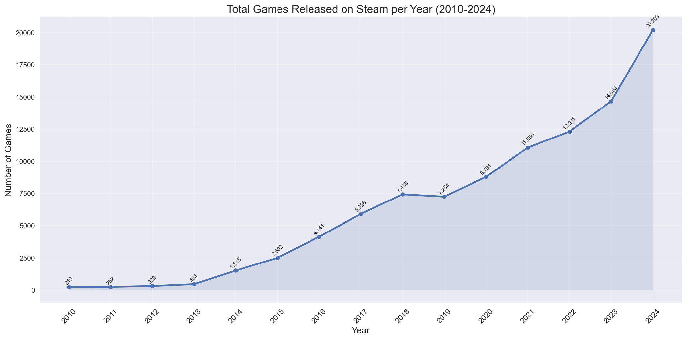
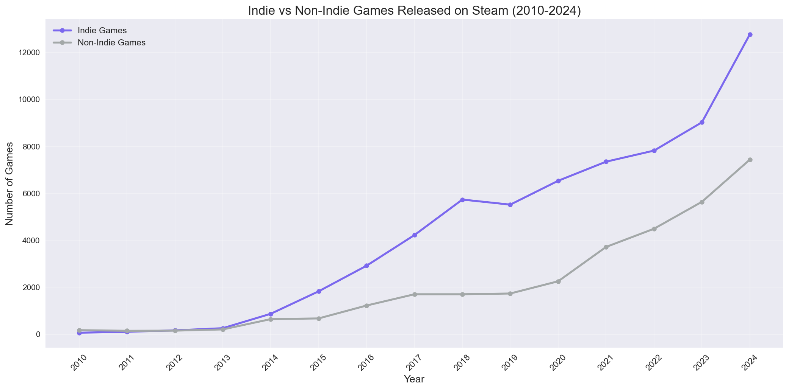
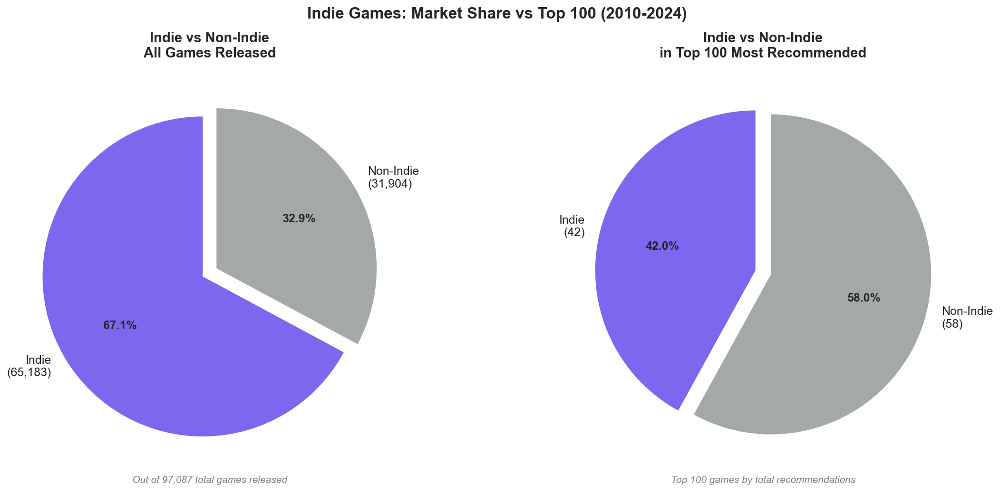
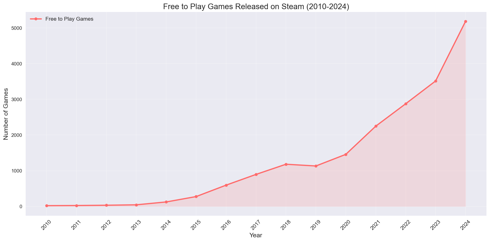
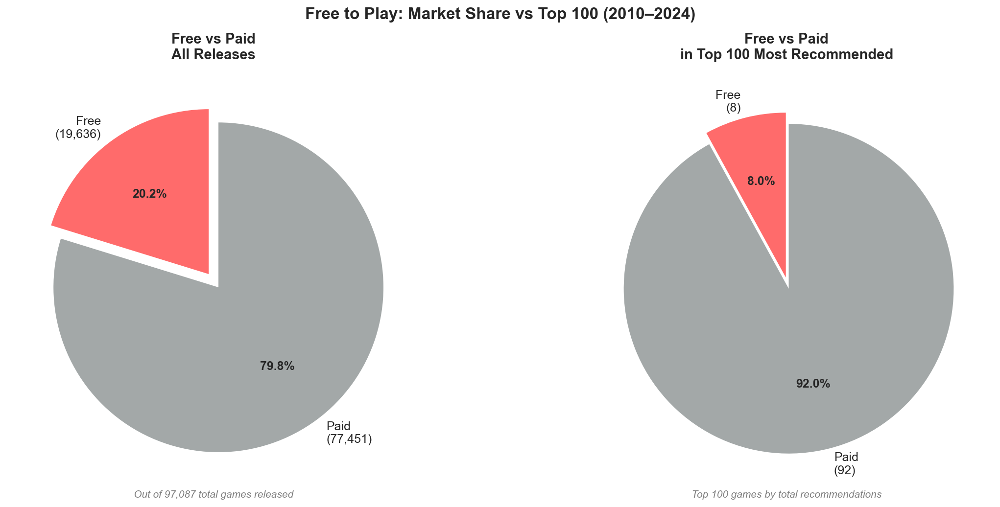
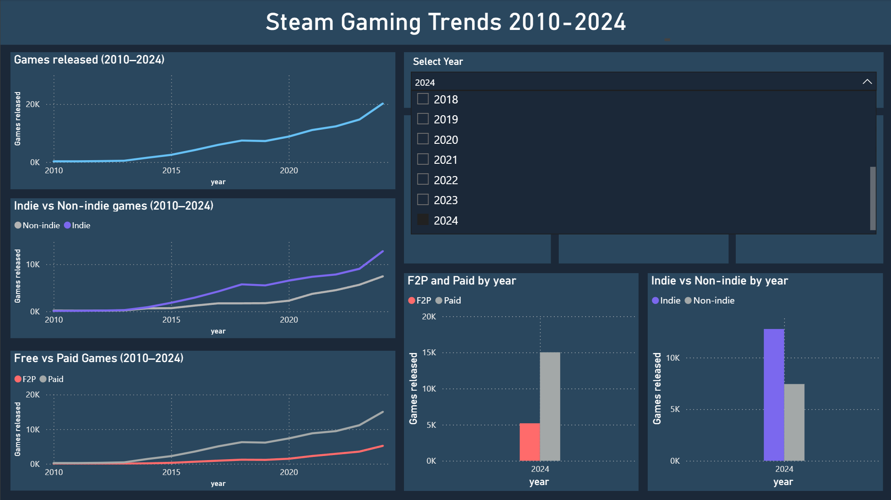
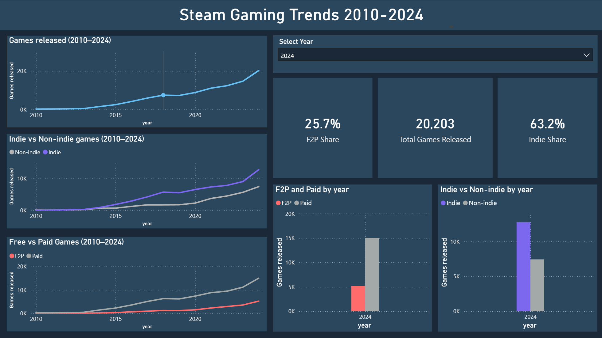

# Steam Gaming Trends Analysis (2010–2024)

An exploratory data analysis of Steam's game catalog, examining how the platform evolved over 15 years with a focus on the rise of indie games and the free-to-play model.

---

## Overview

Steam is the dominant PC gaming storefront, and its catalog is a useful lens for understanding broader shifts in the gaming industry. This analysis explores three main questions:

- How has the volume of games released on Steam changed over time?
- How dominant have indie games become, and does that dominance hold among the most successful titles?
- Has the free-to-play model grown in proportion to its commercial success?

The analysis covers games released between 2010 and 2024, sourced from the Steam API (as of August 2025).

---

## Dataset

- **Source:** Steam API (via Kaggle)
- **Size:** ~1.1M rows across 5 tables
- **Database:** MySQL (`steam_analysis`)
- **Tables:** `applications`, `application_genres`, `genres`, and supporting lookup tables
- **Date range used:** 2010–2024 (pre-2010 data is too sparse to be meaningful)

### Data Quality Notes

- The `is_free` flag in the raw data is unreliable for historical analysis — games like GTA V and PUBG went free-to-play after launch, causing their flag to reflect current status rather than release pricing. Free-to-play classification uses `mat_final_price = 0` instead, which more accurately reflects current pricing without misrepresenting release-era trends.
- Some price values contain regional currency errors (e.g., Hogwarts Legacy listed at $159,800). These anomalies do not affect this analysis since pricing is only used as a binary free/paid classification.
- No sales data is available on Steam. Game popularity is measured using `recommendations_total` (total user recommendations), which is the closest available proxy.

---

## Tools

| Tool | Purpose |
|---|---|
| Python (pandas, matplotlib, seaborn) | Data analysis and visualization |
| MySQL | Data storage and querying |
| SQLAlchemy | Python–MySQL connection |
| Power BI | Interactive dashboard |

---
## Key Findings

**Overall Growth**
Steam's catalog grew steadily from 2010, with growth accelerating sharply after 2014 and again after 2022. The post-2022 spike likely reflects the wider availability of AI-assisted development tools (generative AI, asset creation), which lowered production barriers significantly.

**Indie Games**
Indie titles made up **67.1%** of all games released between 2010 and 2024, up from a small minority in 2010. The inflection point is 2017, when Steam replaced its community-voting Greenlight system with Steam Direct, which allowed any developer to publish for a flat $100 fee. That policy change removed the main gatekeeping mechanism and opened the platform to a large wave of independent releases. Breakout commercial successes like Stardew Valley (2016) and Hollow Knight (2017) also demonstrated that small teams could produce critically acclaimed hits, encouraging more developers to take the leap.

Indie games account for **42%** of the top 100 most recommended games in the same period, a remarkable figure for a category long considered niche, and evidence that quality indie titles do find their audience. The gap relative to their 67.1% volume share reflects genuine structural challenges: limited marketing budgets make discoverability harder, smaller teams have fewer resources for post-launch polish and support, and the sheer volume of indie releases is inflated by low-effort asset flips that drag down the category's overall success rate.

**Free-to-Play**
Free-to-play games made up **20.2%** of all releases between 2010 and 2024. The model grew steadily after 2017, driven by high-profile successes like Fortnite and PUBG that year, and Genshin Impact in 2020, all of which demonstrated the commercial viability of games monetized through microtransactions rather than an upfront purchase.

Yet free-to-play titles make up only **8%** of the top 100 most recommended games in the same period. The gap is less surprising than it looks: the F2P model only gained real momentum after 2017, so most F2P titles haven't had the years of accumulated recommendations that older paid games have. Success is also highly concentrated- a handful of massive outliers like Dota 2 and Team Fortress 2 dominate, while the vast majority of F2P releases fade quickly.

---

## Visualizations

All charts are saved in the `results/` folder and are reproduced below.

| Chart | File |
|---|---|
| Total games released per year | `results/total_games_per_year.png` |
| Indie vs non-indie over time | `results/indie_vs_nonIndie.png` |
| Indie market share vs top 100 | `results/indie_pie_comparison.png` |
| F2P games over time | `results/f2p_evolution.png` |
| F2P market share vs top 100 | `results/f2p_pie_comparison.png` |

### Total Games Released (2010–2024)


### Indie vs Non-Indie Over Time


### Indie: Market Share vs Top 100


### Free-to-Play Over Time


### F2P: Market Share vs Top 100


---

## Interactive Dashboard

An interactive Power BI dashboard is included alongside this analysis. It allows year-by-year filtering of indie and F2P breakdowns, with KPI cards showing aggregate shares for any selected period.

Dashboard screenshots:
### Dashboard Overview


### Dashboard: 2024 Selected


---

## How to Run

1. Clone the repository and set up a MySQL database named `steam_analysis`
2. Import the dataset and run the schema setup (see `sql/` folder if included)
3. Install Python dependencies:
   ```
   pip install pandas matplotlib seaborn sqlalchemy pymysql
   ```
4. Update the connection string in the notebook to match your MySQL credentials
5. Run `steam_analysis.ipynb` top to bottom

---

## Notes on Methodology

- **Top 100 definition:** The top 100 is based on `recommendations_total` filtered to games released between 2010 and 2024, making it directly comparable to the overall release data. It represents the most celebrated games within the same time window for an accurate comparison.
- **Indie classification:** A game is classified as indie if it has the `Indie` genre tag in Steam's genre system. This is self-reported by developers, which means some boundary cases exist, but it is the standard classification used across Steam.
- **Free-to-play classification:** A game is classified as free if `mat_final_price = 0`. This captures current pricing rather than release pricing, which means a small number of games that went free after launch are included.
